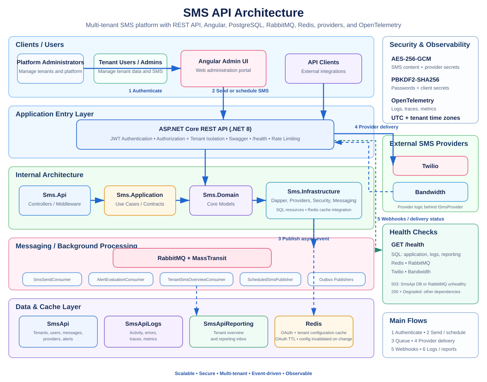

# SMS API

[](https://vibecoded.fyi/)


Multi-tenant REST API for sending, receiving, scheduling, tracking, and querying SMS messages.

## Stack

- ASP.NET Core / .NET 8
- PostgreSQL 17 + Dapper
- Angular 21
- JWT authentication
- Twilio and Bandwidth
- RabbitMQ + MassTransit
- Redis
- OpenTelemetry + ClickStack (ClickHouse)
- Docker Compose for local testing

## Quick start

Requires Docker with Docker Compose.

```bash
docker compose up --build
```

Local services:

- UI: http://localhost:4200
- API: http://localhost:8080
- Swagger: http://localhost:8080/swagger
- Health: http://localhost:8080/health
- PostgreSQL: localhost:5432
- Redis: localhost:6379
- ClickStack / HyperDX: http://localhost:8081
- ClickHouse HTTP: http://localhost:18123
- OTLP: localhost:4317 (gRPC) / localhost:4318 (HTTP)

Local credentials:

```text
Client:    client / client
Platform:  platform / platform
RabbitMQ:  sms / sms
```

Override administrator defaults with `ADMIN_USERNAME`, `ADMIN_PASSWORD`, and `ADMIN_EMAIL`.

Reset the local environment:

```bash
docker compose down --remove-orphans --volumes
docker compose up --build
```

Docker is intended for local testing only. Never use fallback Compose credentials outside development.

Docker Compose defines soft memory reservations for each service:

| Service | Memory reservation |
| --- | ---: |
| PostgreSQL | 128 MB reserved / 256 MB limit |
| RabbitMQ | 256 MB |
| Redis | 64 MB |
| API | 256 MB |
| ClickStack | 512 MB |
| UI | 32 MB |
| Database initialization | 128 MB |
| Provider initialization | 128 MB |
| Webhook tests | 256 MB |

These values are resource reservations, not hard memory limits. Docker may allow a container to use more memory when the host has capacity. The UI starts independently from the API; its Nginx proxy resolves the API dynamically, so the UI container can remain available while backend dependencies are still starting. API requests return a gateway error until the API becomes reachable.

## Features

### Tenant

- Send and schedule SMS messages.
- Query message and status history.
- Reports and overview dashboards.
- Configurable alert rules and in-UI alerts.
- Opt-out management with CSV import/export.
- Tenant user administration.
- Tenant-isolated activity logs.

### Platform

- Manage platform administrators.
- Manage tenants, API clients, and SMS providers.
- View platform reports and system logs.

Swagger documents the complete API surface.

## Messaging

The provider is selected per request. All providers implement `ISmsProvider`, while provider-specific code remains isolated from the application core.

- **Twilio:** signed callbacks using `X-Twilio-Signature`.
- **Bandwidth:** OAuth 2.0 Client Credentials and authenticated callbacks. OAuth access tokens are cached in Redis until shortly before their reported expiration.

Tenant configuration is also cached in Redis. Tenant metadata, time zone, API-client authentication data, and SMS-provider configuration have no time-based cache expiration and are invalidated only after a persisted configuration change. Provider secrets remain encrypted while cached.

Immediate messages are queued through RabbitMQ/MassTransit. Scheduled messages are stored in UTC and queued when due.

To schedule a message, send `scheduledAt` as a local date/time without an offset. The API converts it using the tenant IANA time zone.

```json
{
  "to": "+15551234567",
  "body": "Your appointment is tomorrow.",
  "provider": "Twilio",
  "scheduledAt": "2026-10-20T09:30:00"
}
```

Inbound `STOP`, `UNSUBSCRIBE`, and `CANCEL` opt the number out; `START` removes the block.

## Configuration

Main environment variables:

```text
ConnectionStrings__Postgres
ConnectionStrings__LogsPostgres
ConnectionStrings__ReportingPostgres
ConnectionStrings__Redis
Cache__Enabled
Jwt__Issuer
Jwt__Audience
Jwt__Key
Jwt__ExpirationMinutes
Encryption__MasterKey
Sms__DefaultProvider
Sms__PublicBaseUrl
RabbitMq__Host
RabbitMq__Port
RabbitMq__User
RabbitMq__Password
OTEL_EXPORTER_OTLP_ENDPOINT
OTEL_EXPORTER_OTLP_PROTOCOL
OTEL_SERVICE_NAME
```

`Cache__Enabled` defaults to `true`. Set it to `false` to bypass all Redis-backed caching, including tenant configuration and Bandwidth OAuth tokens; when disabled, the Redis connection string is not required by the API. `Encryption__MasterKey` must be Base64 for exactly 32 bytes. Use HTTPS for real provider callbacks and outside local development. Redis should be reachable only from trusted application infrastructure.

## Health

`GET /health` checks the API dependencies and returns their individual status and latency.

- `postgres.application` — application database; failure makes the API unhealthy.
- `postgres.observability` — tenant activity and platform error-log database.
- `postgres.reporting` — reporting database.
- `redis` — Redis connectivity used by the caches; reports `Healthy` with `Cache is disabled.` when caching is disabled.
- `rabbitmq` — RabbitMQ TCP connectivity.
- `twilio` — Twilio API reachability.
- `bandwidth` — Bandwidth API reachability.

The endpoint returns HTTP `503` when a critical internal dependency is unhealthy. Reporting, observability, Redis, and external provider failures are reported as `Degraded` without taking the API out of rotation.

Provider checks validate network/API reachability only. They do not validate tenant-specific credentials and do not expose connection strings, credentials, tokens, or exception details.

## Database

The project uses Dapper and does not use migrations. Runtime SQL is stored under `src/Sms.Infrastructure/Sql`.

Fresh databases are initialized from:

- `database/schema.sql` — application data
- `database/logs-schema.sql` — tenant activity and platform error logs
- `database/reporting-schema.sql` — reporting projections

All dates are stored in UTC. Each tenant has an IANA time zone used for display, filters, and scheduled delivery.

Application data, tenant activity logs, reporting data, opt-outs, provider credentials, alerts, and message processing are tenant-isolated.

Technical OpenTelemetry logs, traces, and metrics are exported over OTLP to the local ClickStack service and stored in ClickHouse. Tenant user activity and error-level platform logs remain in PostgreSQL so the existing tenant and platform log APIs keep their authorization and isolation semantics. ClickStack is technical observability infrastructure and must not be exposed as a tenant-facing log source.

## Security

- Tenant ownership is derived from authenticated JWT claims.
- JWT separates tenant users, tenant administrators, and platform administrators.
- Tenant portal users authenticate with tenant code + username + password, so usernames may be reused safely across tenants.
- SMS content and provider secrets use AES-256-GCM encryption.
- Passwords and client secrets use PBKDF2-SHA256 with at least 600,000 iterations.
- Provider webhooks are authenticated whenever supported.
- Technical logs store only error-level events.
- Secrets, tokens, authorization headers, SMS bodies, and full phone numbers must not be logged.
- MFA and self-service password recovery are not yet implemented.

## Provisioning

Create the first platform administrator outside Compose:

```bash
dotnet run --project tools/Sms.Provision -- --admin
```

Provide `ConnectionStrings__Postgres`, `Admin__Username`, `Admin__Password`, and `Admin__Email` through the environment.

Tenants can then be created through the platform administration UI or API. Generated client secrets are returned once.

## Tests and CI

```bash
dotnet restore Sms.Api.sln
dotnet build Sms.Api.sln --configuration Release
dotnet test Sms.Api.sln --configuration Release --collect:"XPlat Code Coverage" --settings coverlet.runsettings
```

Pushes to `main` build and test the backend and Angular UI and require at least **80% backend line coverage**.

PostgreSQL integration tests and the Docker Compose bootstrap run only from a manually started workflow.

## Architecture

### Docker Compose



The diagram reflects the current Docker Compose topology and startup dependencies. PostgreSQL hosts isolated databases for application data, tenant/platform audit logs, and reporting. Technical OpenTelemetry logs, traces, and metrics are sent through OTLP to ClickStack and stored in ClickHouse. The API starts only after database and provider initialization complete and RabbitMQ and Redis are healthy. The optional `webhook-tests` service is enabled through the `tests` profile.

```text
src/Sms.Api              HTTP, authentication, authorization
src/Sms.Application      Use cases and contracts
src/Sms.Domain           Domain models
src/Sms.Infrastructure   SQL, providers, encryption, observability
ui                       Angular UI
database                 Database schemas and test seeds
tools/Sms.Provision      Bootstrap provisioning
tests                    Unit and integration tests
```

## Roadmap

### Account security

- [ ] MFA for platform and tenant administrators.
- [ ] Self-service password recovery.
- [ ] Session management and token revocation.
- [ ] Configurable password and lockout policies.

### Operations

- [ ] Email and webhook alert delivery.
- [ ] Alert retry history and dead-letter handling.
- [ ] Operational dashboards for queues, backlog, provider latency, and failures.
- [ ] Configurable data retention.

### Messaging

- [x] Scheduled delivery in the tenant time zone.
- [ ] Bulk sends with validation, progress, cancellation, and per-recipient results.
- [ ] Message templates.
- [ ] Inbound auto-replies and routing rules.

### Extensibility

- [ ] Provider failover and routing policies.
- [ ] Provider health and cost reporting.
- [ ] Provider extension guide and contract tests.
- [ ] Additional provider implementation.
