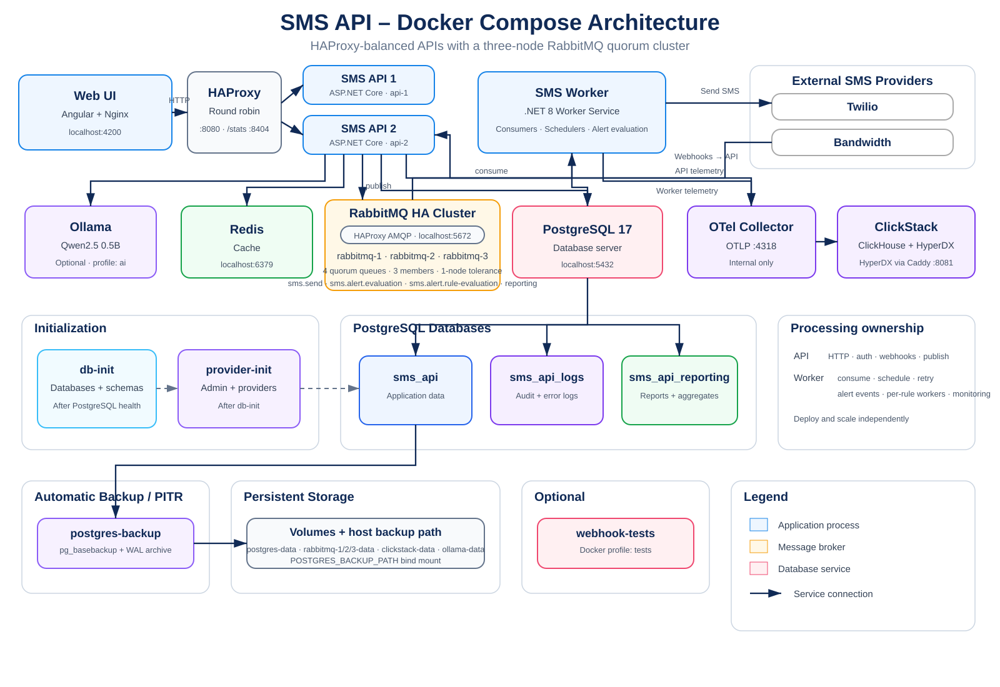
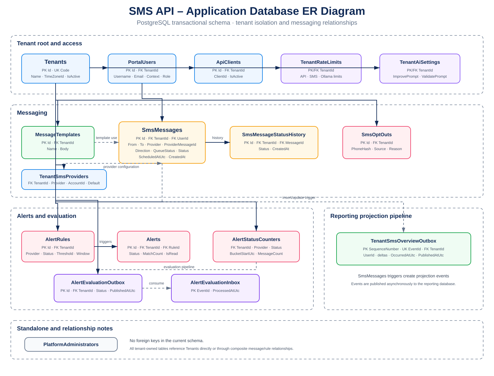

# SMS API

[](https://github.com/hebermattos/SMS-api/actions/workflows/ci.yml)
[](https://github.com/hebermattos/SMS-api/actions/workflows/integration-tests.yml)

[](https://vibecoded.fyi/)


Production-oriented multi-tenant SMS platform for sending, receiving, scheduling, tracking, and reporting messages through multiple providers.

**Highlights:** strict tenant isolation · Twilio/Bandwidth provider abstraction · RabbitMQ workers · UTC scheduling with tenant time zones · encrypted SMS/provider data · reporting · OpenTelemetry · local AI assistance.

## Technology

| Area | Technology |
| --- | --- |
| API | ASP.NET Core / .NET 8 |
| Load balancing | HAProxy |
| Data | PostgreSQL 17 + Dapper |
| UI | Angular 21 |
| Messaging | RabbitMQ + MassTransit |
| Cache | Redis |
| Providers | Twilio + Bandwidth |
| Observability | OpenTelemetry + ClickStack / ClickHouse |
| Local AI | Ollama + Qwen2.5 0.5B |
| Local runtime | Docker Compose |

## Quick start

Requires Docker with Docker Compose.

```bash
docker compose up --build
```

The default stack does not start the local AI services. Enable Ollama only when AI assistance is needed:

```bash
docker compose --profile ai up --build
```

Local services:

| Service | Address | Notes |
| --- | --- | --- |
| UI | `http://localhost:4200` | Angular administration UI |
| API (HAProxy → 2 API instances) | `http://localhost:8080` | Single host-facing API endpoint |
| HAProxy stats | `http://localhost:8404/stats` | Local-only backend health, sessions, requests, and errors |
| Swagger | `http://localhost:8080/swagger` | API documentation |
| Health | `http://localhost:8080/health` | Dependency health through HAProxy |
| HyperDX | `http://localhost:8081` | Technical telemetry UI |
| RabbitMQ Management | `http://localhost:15672` | Queue management UI (node 1) |
| PostgreSQL | `localhost:5432` | Application, logs, and reporting databases |
| Redis | `localhost:6379` | Shared cache and distributed rate-limit state |
| ClickHouse HTTP | `http://localhost:18123` | Technical telemetry storage |

Local credentials:

```text
Client:    client / client
Platform:  platform / platform
HyperDX:   HyperDX / HyperDX
RabbitMQ:  sms / sms
```

Override administrator defaults with `ADMIN_USERNAME`, `ADMIN_PASSWORD`, and `ADMIN_EMAIL`. Override the local HyperDX access credentials with `HYPERDX_USERNAME` and `HYPERDX_PASSWORD`.

Reset the local environment:

```bash
docker compose down --remove-orphans --volumes
docker compose up --build
```

Database backups are stored outside Docker volumes in `./backups` by default, so `docker compose down --volumes` does not delete them. Set `POSTGRES_BACKUP_PATH` to an absolute path on independent storage for stronger protection.

> Docker is intended for local testing only. Never use fallback Compose credentials outside development. Resource reservations and limits are defined directly in `docker-compose.yml`; treat that file as the source of truth. The current limits are intentionally sized for integration testing and a single-user local environment; Ollama is excluded from the default stack through the `ai` profile to reduce idle resource usage.

## Features

### Tenant

- Send and schedule SMS messages. Outbound messages may be associated with a tenant user; portal sends are associated automatically, while API clients may supply an optional `userId`.
- Use the local AI assistant to get improvement suggestions for SMS/template text without sending message content to a hosted AI service.
- Create reusable message templates with `{{variableName}}` variables. System variables include `{{recipientName}}`, `{{recipientPhone}}`, and `{{tenantName}}`; custom variables can be supplied by API, CSV, or UI workflows.
- Query message and status history.
- Reports and overview dashboards, with CSV download of the currently displayed report table.
- Configurable alert rules and in-UI alerts.
- Opt-out management with CSV import/export.
- Tenant user administration.
- Tenant-isolated activity logs.

### Platform

- Manage platform administrators.
- Manage tenants, API clients, and SMS providers.
- View platform reports and system logs.

Swagger documents the complete API surface.

## Local AI message assistant

When the `ai` profile is enabled, Docker Compose runs Ollama locally with `qwen2.5:0.5b`, a small model intended for lightweight message assistance. The API exposes authenticated `POST /api/v1/message-assistant/improve` and `POST /api/v1/message-assistant/validate` endpoints. AI assistant requests use a dedicated `OllamaRequestsPerMinute` rate-limit bucket; see [Rate limiting](#rate-limiting) for limits and enforcement details.

Ollama model initialization runs independently from the API startup. A slow or failed model pull does not prevent the API from starting; AI assistance becomes available after `ollama-init` successfully downloads the model.

The tenant UI exposes a single **AI tips** action for SMS messages and templates. It uses the validation endpoint to review clarity, spelling, tone, length, ambiguous wording, and malformed template placeholders, then returns concise improvement suggestions without automatically rewriting the user's text. It does not make legal/compliance decisions.

The backend keeps both `/improve` and `/validate` endpoints available for API compatibility, but the tenant UI uses only `/validate`. SMS/template content sent to the assistant stays inside the local Ollama deployment. AI output is advisory and should be reviewed before sending. Platform administrators can configure the tenant AI prompts from the company settings screen; the validation prompt controls the AI tips experience.

## Rate limiting

Rate limiting is enforced per authenticated tenant/login and request bucket. Counters are stored in Redis, so all API instances behind HAProxy share the same limits.

| Bucket | Default limit | Scope |
| --- | ---: | --- |
| API requests | 120 requests/minute | Tenant + login |
| SMS sends | 10 requests/minute | Tenant + login |
| Ollama / AI assistant | 6 requests/minute | Tenant + login |

The effective key combines **tenant + login + request bucket**, preventing one authenticated user from consuming another user's allowance. Exceeding a configured limit returns HTTP `429 Too Many Requests`.

The platform can configure tenant rate limits. The values are persisted with the tenant configuration rather than being tied to a specific API instance. Redis contains the distributed counters used to enforce those configured limits.

The Ollama bucket is intentionally more restrictive because local model inference is comparatively expensive. Its default of 6 requests per minute is equivalent to an average of one request every 10 seconds.

## Messaging

Outbound provider calls use a platform-wide transient-failure retry policy. HTTP 429, HTTP 5xx, and provider network failures are retried with exponential backoff. Permanent provider errors, invalid configuration, invalid numbers, and opt-out failures are not retried. The defaults are 3 retries with an initial 60-second interval (approximately 1, 2, and 4 minutes). Configure globally with `SmsRetry__MaxAttempts` and `SmsRetry__InitialIntervalSeconds`; the effective policy is available to platform administrators at `GET /api/v1/admin/sms-retry`.

The provider is selected per request. All providers implement `ISmsProvider`, while provider-specific code remains isolated from the application core.

- **Twilio:** signed callbacks using `X-Twilio-Signature`.
- **Bandwidth:** OAuth 2.0 Client Credentials and authenticated callbacks. OAuth access tokens are cached in Redis until shortly before their reported expiration.

Tenant configuration is also cached in Redis. Tenant metadata, time zone, API-client authentication data, SMS-provider configuration, rate-limit settings, and AI/Ollama prompts have no time-based cache expiration and are invalidated only after a persisted configuration change. Provider secrets remain encrypted while cached.

Immediate messages are queued through RabbitMQ/MassTransit. Scheduled messages are stored in UTC and queued when due.

Docker Compose runs a three-node RabbitMQ cluster. Application AMQP connections use a dedicated HAProxy endpoint on port `5672`, which health-checks all three brokers and removes failed nodes from connection rotation. The application queues (`sms.send`, `sms.alert.evaluation`, and `sms.reporting.overview`) are quorum queues with three members, so one RabbitMQ node can fail while a majority remains available. Each broker has its own persistent Docker volume.

All three RabbitMQ containers run on the same Docker host in the local Compose environment. This provides broker/container failover for development, but not host-level high availability. A production deployment should place the three RabbitMQ nodes on separate hosts or failure domains while retaining an odd-sized quorum.

To schedule a message, send `scheduledAt` as a local date/time without an offset. The API converts it using the tenant IANA time zone. API clients may also send an optional `userId`; when provided, it must identify an active user in the authenticated tenant.

```json
{
  "to": "+15551234567",
  "body": "Your appointment is tomorrow.",
  "provider": "Twilio",
  "scheduledAt": "2026-10-20T09:30:00"
}
```

Inbound `STOP`, `UNSUBSCRIBE`, and `CANCEL` opt the number out; `START` removes the block.

## Configuration

Main environment variables:

```text
ConnectionStrings__Postgres
ConnectionStrings__LogsPostgres
ConnectionStrings__ReportingPostgres
ConnectionStrings__Redis
Cache__Enabled
Jwt__Issuer
Jwt__Audience
Jwt__Key
Jwt__ExpirationMinutes
Encryption__MasterKey
Sms__DefaultProvider
Sms__PublicBaseUrl
RabbitMq__Host
RabbitMq__Port
RABBITMQ_ERLANG_COOKIE
RabbitMq__User
RabbitMq__Password
HYPERDX_USERNAME
HYPERDX_PASSWORD
OTEL_EXPORTER_OTLP_ENDPOINT
OTEL_EXPORTER_OTLP_PROTOCOL
OTEL_SERVICE_NAME
```

`Cache__Enabled` defaults to `true`. Set it to `false` to bypass Redis-backed caching, including tenant configuration and Bandwidth OAuth tokens. This setting does **not** disable distributed rate limiting: `ConnectionStrings__Redis` remains required by the API because rate-limit counters are always stored in Redis and shared by all API instances. `Encryption__MasterKey` must be Base64 for exactly 32 bytes. Use HTTPS for real provider callbacks and outside local development. Redis should be reachable only from trusted application infrastructure.

## Health

`GET /health` checks the API dependencies and returns their individual status and latency.

- `postgres.application` — application database; failure makes the API unhealthy.
- `postgres.observability` — tenant activity and platform error-log database.
- `postgres.reporting` — reporting database.
- `redis` — Redis connectivity used by caching and distributed rate limiting. Redis remains an API dependency when `Cache__Enabled=false` because distributed rate-limit counters still use it.
- `rabbitmq` — RabbitMQ AMQP load-balancer connectivity.
- `twilio` — Twilio API reachability.
- `bandwidth` — Bandwidth API reachability.

The endpoint returns HTTP `503` when a critical internal dependency is unhealthy. Reporting, observability, Redis, and external provider failures are reported as `Degraded` without taking the API out of rotation.

Provider checks validate network/API reachability only. They do not validate tenant-specific credentials and do not expose connection strings, credentials, tokens, or exception details.

## Database

The project uses Dapper and does not use migrations. Runtime SQL is stored under `src/Sms.Infrastructure/Sql`.

Fresh databases are initialized from:

- `database/schema.sql` — application data
- `database/logs-schema.sql` — tenant activity and platform error logs
- `database/reporting-schema.sql` — reporting projections

### Automatic backup and point-in-time recovery

Docker Compose protects PostgreSQL with two complementary mechanisms:

- A physical base backup created every 24 hours with `pg_basebackup`.
- Continuous WAL archiving, with PostgreSQL forcing an archive segment switch at least every 60 seconds by default.

Together, the base backup and archived WAL files support **Point-in-Time Recovery (PITR)**. A restore can replay database changes after the latest base backup up to a selected UTC recovery timestamp. This avoids the previous design's potential loss of up to 24 hours of data.

The defaults can be changed with:

```text
POSTGRES_BACKUP_PATH=./backups
BACKUP_INTERVAL_SECONDS=86400
BACKUP_RETENTION_DAYS=7
WAL_ARCHIVE_TIMEOUT_SECONDS=60
```

`POSTGRES_BACKUP_PATH` is a host bind mount rather than a Docker named volume. Therefore, `docker compose down --volumes` does not remove the backups. For production, set it to storage independent from the PostgreSQL data disk/host and copy or replicate it to off-site storage.

Base backups are written to a temporary directory and renamed only after `pg_basebackup` succeeds. WAL files are archived continuously under `<backup-path>/wal`. Both base backups and archived WAL files use the configured retention period.

List the backups and archived WAL files:

```bash
ls -lh ./backups/base
ls -lh ./backups/wal
```

For PITR, restore the selected physical base backup into an empty PostgreSQL data directory, make the corresponding archived WAL files available, configure `restore_command` to copy WAL files from the archive, set `recovery_target_time` to the required UTC timestamp, create `recovery.signal`, and start PostgreSQL. Recovery must be tested regularly before relying on the backup as a disaster-recovery mechanism.

The default `WAL_ARCHIVE_TIMEOUT_SECONDS=60` bounds how long a low-traffic server can keep an unarchived partial WAL segment before PostgreSQL forces a switch. It is an **RPO target, not a zero-data-loss guarantee**: host/storage failure can still lose WAL that has not reached independent storage. Guaranteed zero data loss across a complete database-host failure requires synchronous replication to another PostgreSQL instance in addition to backups.

All dates are stored in UTC. Each tenant has an IANA time zone used for display, filters, and scheduled delivery.

Application data, tenant activity logs, reporting data, opt-outs, provider credentials, alerts, and message processing are tenant-isolated.

## Observability

Observability is deliberately split between **audit data** and **technical telemetry**:

| Data | Destination | Access |
| --- | --- | --- |
| Tenant user activity | PostgreSQL `sms_api_logs` | Tenant users, filtered by tenant |
| Platform error logs | PostgreSQL `sms_api_logs` | Platform users |
| OpenTelemetry logs | ClickStack / ClickHouse | Technical operations |
| OpenTelemetry traces | ClickStack / ClickHouse | Technical operations |
| OpenTelemetry metrics | ClickStack / ClickHouse | Technical operations |

The API and Worker export technical telemetry over OTLP to a dedicated ClickStack OpenTelemetry Collector running in standalone mode. The collector writes directly to the ClickHouse instance bundled with ClickStack, while HyperDX remains the visualization UI. This keeps high-volume telemetry writes out of the PostgreSQL audit database while preserving the existing authorization and tenant-isolation model for user activity logs.

In Docker Compose both API instances and the Worker send OTLP/HTTP protobuf to `http://otel-collector:4318`. Both API instances keep the logical OpenTelemetry service name `sms-api`, while `service.instance.id` identifies them individually as `api-1` and `api-2`. This allows HyperDX to aggregate the APIs as one service or filter logs, traces, metrics, latency, and errors by a specific instance. The collector is reachable only inside the Compose network, so its OTLP ports are not published to the host and local startup does not depend on a HyperDX-generated ingestion key. The collector writes to `http://clickstack:8123`. The local ClickStack container runs its HyperDX UI without built-in authentication and is reachable only inside the Compose network. A small Caddy proxy exposes HyperDX at `http://localhost:8081` with Basic Auth, defaulting to `HyperDX / HyperDX`; override those development defaults with `HYPERDX_USERNAME` and `HYPERDX_PASSWORD`. The ClickHouse HTTP endpoint is mapped to `18123`.

ClickStack is technical infrastructure and must not be exposed as a tenant-facing log source. Secrets, access tokens, authorization headers, SMS bodies, and full phone numbers must never be emitted as telemetry.

## Security

- Tenant ownership is derived from authenticated JWT claims.
- JWT separates tenant users, tenant administrators, and platform administrators.
- Tenant portal users authenticate with tenant code + username + password, so usernames may be reused safely across tenants.
- SMS content and provider secrets use AES-256-GCM encryption.
- Passwords and client secrets use PBKDF2-SHA256 with at least 600,000 iterations.
- Provider webhooks are authenticated whenever supported.
- Technical logs store only error-level events.
- Secrets, tokens, authorization headers, SMS bodies, and full phone numbers must not be logged.
- MFA and self-service password recovery are not yet implemented.

## Provisioning

Create the first platform administrator outside Compose:

```bash
dotnet run --project tools/Sms.Provision -- --admin
```

Provide `ConnectionStrings__Postgres`, `Admin__Username`, `Admin__Password`, and `Admin__Email` through the environment.

Tenants can then be created through the platform administration UI or API. Generated client secrets are returned once.

## Tests and CI

```bash
dotnet restore Sms.Api.sln
dotnet build Sms.Api.sln --configuration Release
dotnet test Sms.Api.sln --configuration Release --collect:"XPlat Code Coverage" --settings coverlet.runsettings
```

Pushes to `main` build and test the backend and Angular UI and require at least **80% backend line coverage**.

PostgreSQL integration tests and the Docker Compose bootstrap run only from a manually started workflow.

## Architecture

### Docker Compose



Docker Compose runs two independent API instances behind HAProxy. HAProxy exposes `http://localhost:8080`, distributes requests using round-robin, and actively checks each API through `GET /health`; unhealthy instances are removed from rotation automatically. It forwards the original client IP, protocol, and host through `X-Forwarded-For`, `X-Forwarded-Proto`, and `X-Forwarded-Host`, which ASP.NET Core processes before rate limiting and authentication.

HAProxy exposes local-only runtime statistics on `http://localhost:8404/stats`. HAProxy and both API containers use a 30-second Docker stop grace period, allowing in-flight requests to finish before containers are terminated.

The diagram reflects the current Docker Compose topology and startup dependencies, including the dedicated AMQP HAProxy, three RabbitMQ cluster members, three-member quorum queues, and per-node persistent volumes. PostgreSQL hosts the application, audit/error-log, and reporting databases. Redis provides caching, a three-node RabbitMQ quorum cluster behind a dedicated HAProxy handles asynchronous messaging between the API and the independently deployed Worker, and the standalone OpenTelemetry Collector receives technical logs, traces, and metrics from both processes and persists them in the ClickHouse instance bundled with ClickStack.

### Database ER diagram



The diagram keeps the database model in a single image. It contains the transactional schema from `database/schema.sql` and the reporting read model from `database/reporting-schema.sql`, while preserving the boundary between `sms_api` and `sms_api_reporting`. The reporting flow is `SmsMessages → TenantSmsOverviewOutbox → RabbitMQ → Worker → ReportingSmsMessages → daily tenant/provider/user aggregates`. The audit/error-log database remains separate. `PlatformAdministrators` and `AlertEvaluationInbox` have no foreign-key relationships in the transactional schema.

The two API containers and Worker are separate processes and can be deployed and scaled independently. HAProxy is the single host-facing API entry point; API containers are reachable only on the internal Compose network. The API handles HTTP, authentication, authorization, webhooks, and RabbitMQ publishing. The Worker owns RabbitMQ consumers, scheduled-message publishing, failed-publish retry, alert outbox publishing, and RabbitMQ monitoring. Both wait for their required infrastructure dependencies before starting. HyperDX browser access is exposed separately through the Basic Auth proxy. The optional `webhook-tests` service is enabled through the `tests` profile.

```text
src/Sms.Api              HTTP, authentication, authorization, webhooks, RabbitMQ publishing
src/Sms.Worker           RabbitMQ consumers and background workers
src/Sms.Application      Use cases and contracts
src/Sms.Domain           Domain models
src/Sms.Infrastructure   SQL, providers, encryption, observability
ui                       Angular UI
database                 Database schemas and test seeds
tools/Sms.Provision      Bootstrap provisioning
tests                    Unit and integration tests
```

## RabbitMQ operations

### Monitoring

The Worker collects RabbitMQ queue metrics from the Management API every five minutes and exports them through the existing OpenTelemetry pipeline to ClickStack/HyperDX.

- `rabbitmq.queue.messages.ready`: messages waiting for a consumer.
- `rabbitmq.queue.messages.unacknowledged`: messages currently being processed.
- `rabbitmq.queue.consumers`: active consumers per queue.

Metrics include the `rabbitmq.queue` attribute for filtering. The monitored queues are `sms.send`, `sms.alert.evaluation`, and `sms.reporting.overview`. Collection failures are logged as errors.


### High availability

The local topology is:

```text
API instances / Worker
          |
     rabbitmq-lb
      HAProxy :5672
       /   |   \
      /    |    \
rabbitmq-1 rabbitmq-2 rabbitmq-3
      \    |    /
       quorum queues (3 members)
```

RabbitMQ nodes share the same Erlang cookie so they form one cluster. Override `RABBITMQ_ERLANG_COOKIE` outside local development and keep it secret. HAProxy handles new AMQP connection failover; RabbitMQ quorum queues handle durable message replication and leader election. These mechanisms complement the existing database-backed failed-publish recovery and do not create a distributed transaction between PostgreSQL and RabbitMQ.
